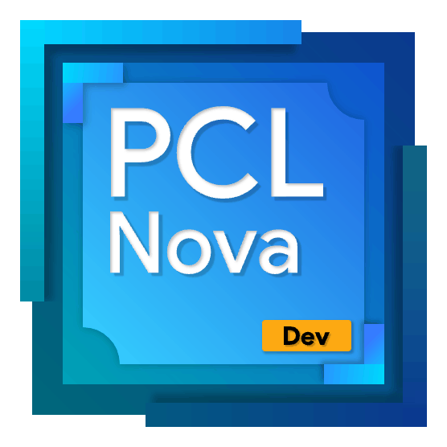

# PCL II Nova App

下一代 PCL 启动器，基于官方版 PCL2 的完全重构\
采用 Web 技术和内存安全的 Go 全新构建\
这，就是 PCL II: Nova！

第一个可用（功能有限）发行版计划于 2025.7 之前推出\
在此之前你可以自行下载代码编译运行\
请确保安装 Node 21+ 和 GoLang\
你可以参阅[该网址](https://wails.io/docs/gettingstarted/installation)初始化项目，随后构建~
     
加入 PCL II Nova 交流 1 群，与开发者面对面交流，获取\
最新资讯：https://qm.qq.com/q/nwBlYWMhHM

有以下须知需要你查阅：

1. 目前，本项目有[@xphost008](https://github.com/xphost008)进行维护，你可以随时随地查看本项目更新日志：[Changelog](./CHANGELOG.md)
2. 如果你使用的操作系统与作者的一样，是Windows系统！那么恭喜你，你可以直接从[蓝奏云](https://wwdy.lanzoub.com/b0sx0e10h)直接下载，密码：eim6
3. 欢迎随时随地收看来自老作者**MoYuan-CN**的新项目[NovaCL](https://github.com/NEXORA-Studios/NovaCL)！！
4. 如果你还不认识这位新作者的话，你可以参阅[作者的博客](https://xphost008.github.io)。
